# latihan-vcs
# Tutorial Login Github, Membuat Repository Baru di Github, Instal Git, dan Cara Penggunaan Git 
## Cara Login dan Membuat Repository Baru 
### 1. Pertama ke browser 
- masukan link url https://github.com 
### 2. Setelah masuk saatnya membuat akun, jika belum memiliki akun silahkan daftar terlebih dahulu, jika sudah tinggal masuk aja 
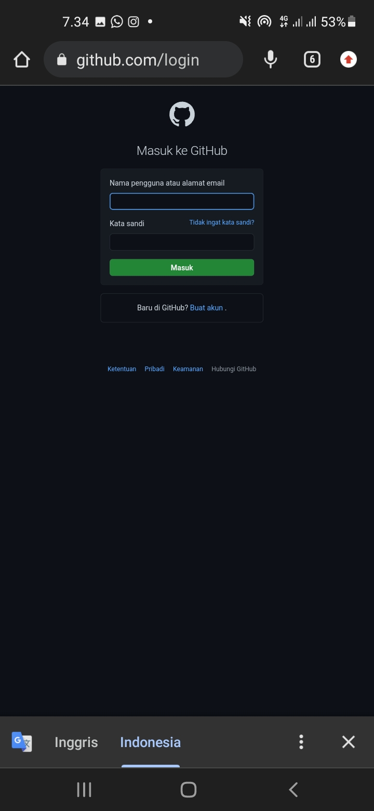 
### 3. Setelah berhasil login di github, saatnya anda membuat file repository baru, seperti gambar dibawah ini 
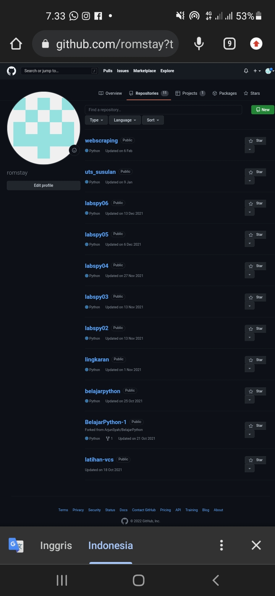 
### 4. Isikan repository name, dan pilih repository untuk jadi file public atau private, saya buat public disini, setelah itu centang pilihan add a readme file, lalu klik create repository 
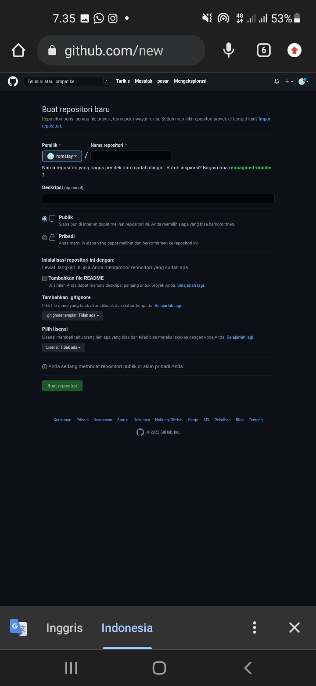 
## Cara Install Git di Windows 
### 1. Unduh Git 
- Untuk menginstall git, anda perlu mengunduh file-nya terlebih dahulu di situs resminya. karena saya pakai git-scm, linknya adalah https://git-scm.com/ 
### 2. Install Git 
- Setelah selesai mengunduh file Git, silahkan install aplikasi nya, caranya seperti dibawah ini 
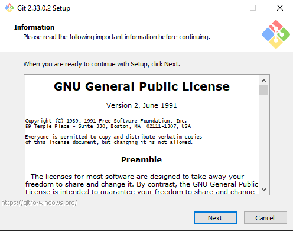 
- Lalu klik next terus seperti gambar dibawah, sampai ke menu install 
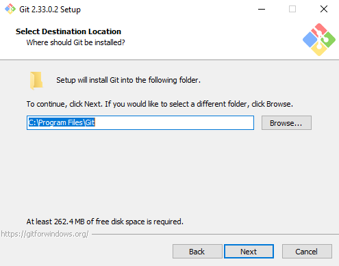 
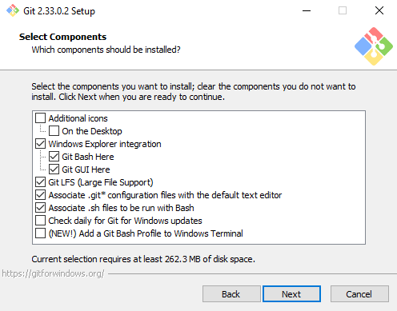 
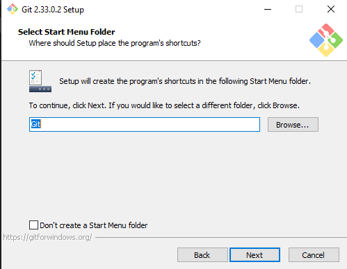 
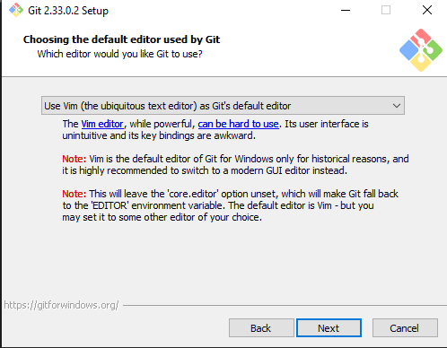 
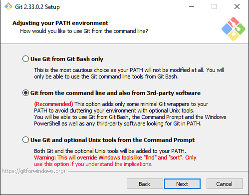 
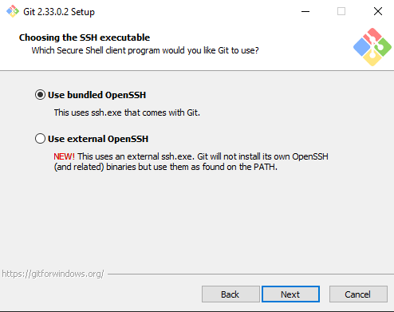 
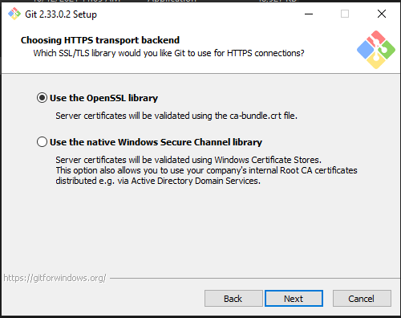 
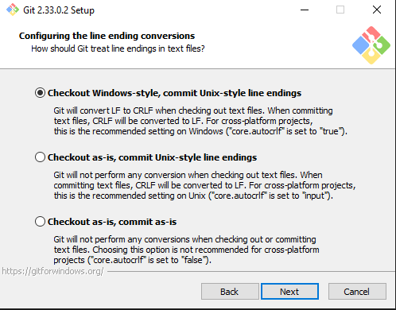 
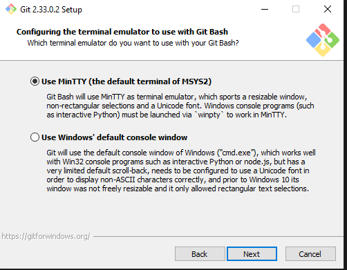 
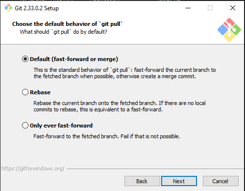 
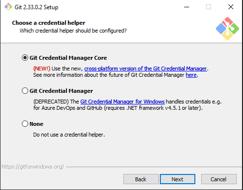
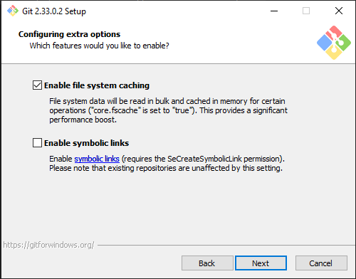 
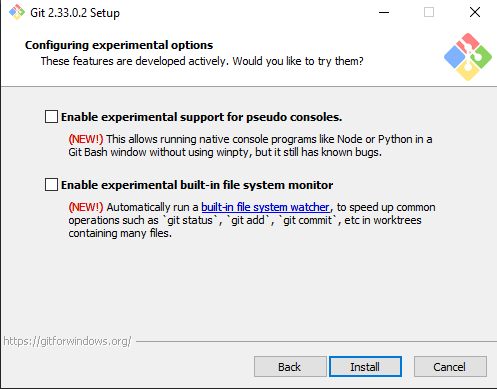 
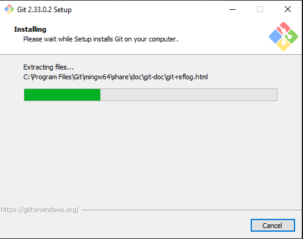 
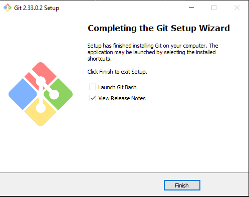 

- setelah finish git sudah dapat diguanakn 
## Cara Penggunaan Git 
### Pada saat pertama kali menggunakan Git, perlu dilakukan konfigurasi Username dan Email. Dengan perintah berikut: 
- > git config --global user.name "username" 
- > git config --global user.email "email"  
### Selanjunya kita siapkan directory dan folder, yang bertujuan untuk menyimpan repository yang akan kita clone dari git hub. Dengan perintah berikut: 
- > cd /"directory"/"nama folder"/ 
### Nah setelah itu cara untuk mengaitkan/menambahkan repository, saya disini mengambil dari server dengan cara dan perintah berikkut: 
### - Pertama masuk terlebih dahulu ke git hub 
### - Kemudian salin link repositpry yang ingin anda kaitkan dengan komputer anda 
### - disini saya membuat repository dengan nama "Latihan-Vcs" kemudian saya salin urlnya 
### Setelah itu kita masuk lagi ke git bash(yang ada dikomputer), dengan memasukan perintah: 
- > git clone "url repository yang ada di git hub"  
### Maka otomatis kita sudah membuat repository dikomputer local kita 
### Kita akan mengecek apakah di repository sudah ada filenya, dengan memasukan perintah

### Nah disini saya sudah mempunyai file dengan nama README.md  
### Nah setelah project kita sudah selesai, kita kembali lagi ke git bash 
### disini kita cek terlebih dahulu ada perubahan apa saja yang terjadi. Misalnya ada file baru kah, ada file yang diubah ataupun yang di hapuskah, dengan memasukan printah
### Nah disitu keterangannya bahwa file README.md masih berada distate modified atau di area working directory kita bisa lihat juga dengan warnanya yang berwarna merah 
### Selanjutnya kita akan memindahkan atau menambahkan file yang saya buat ke staging area dengan perintah : 
- > git add "file yang ingin ditambhkan" 
### Nah setelah itu kita akan menyimpan perubahan dari staging area ke Repository local kita, dengan mecommit file dan harus disertai dengan komentar, dengan menggunakan perintah : 
- > git commit -m "komentar apa saja"
### Oke step by step sudah kita jalankan, kita lanjut ke step trakhir ### di step trakhir ini kita akan mengirim prubahan pada repository local ke server, dengan menggunakan printah: 
- > git push -u origin main 
# Selesai, Sekian dan Trimakasih